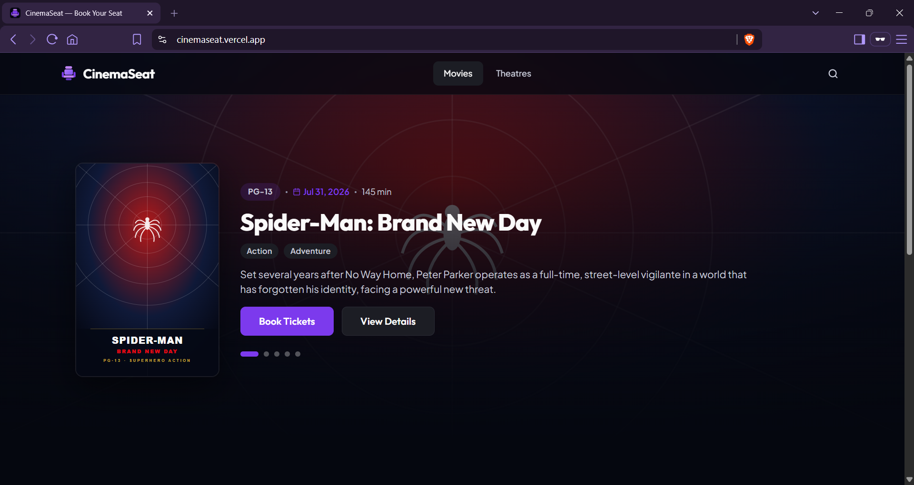

[](#) [](#) [](#) [](#) [](#) [](#) [](#) [](#)

# CinemaSeat

> Concurrency-safe cinema ticket booking engineered around strict seat reservation invariants.

CinemaSeat is a cinema booking platform built around one core invariant: a seat must never be confirmed for more than one user.

<p align="center">
  
</p>

**Live Demo:** [https://cinemaseat.vercel.app](https://cinemaseat.vercel.app)

## Contents

1. [Project Overview](#project-overview)
2. [Hackathon Context](#hackathon-context)
3. [What Is Built](#what-is-built)
4. [Key Engineering Features](#key-engineering-features)
5. [Architecture](#architecture)
6. [Booking Flow](#booking-flow)
7. [Reliability & Concurrency](#reliability--concurrency)
8. [Payment & OTP Gateway](#payment--otp-gateway)
9. [Technology Stack](#technology-stack)
10. [Repository Structure](#repository-structure)
11. [Running Locally](#running-locally)
12. [API / Verification Endpoints](#api--verification-endpoints)
13. [Testing & Verification](#testing--verification)
14. [Documentation](#documentation)
15. [Post-Hackathon Improvements](#post-hackathon-improvements)

## Project Overview

CinemaSeat provides an interface for browsing movies, selecting showtimes, and booking tickets. Under heavy concurrent load—such as when booking premiere seats—multiple users will compete for the same seats. CinemaSeat preserves system correctness by ensuring that seat allocation remains correct and concurrency-safe: it guarantees that a seat can never be double-booked or oversold, even during sudden traffic spikes, while automatically releasing abandoned holds so that seats return to the available pool.

## Hackathon Context

CinemaSeat was built during **Zero to Production — Phase 2: The Ultimate Hackathon** (also known as **The IEEECS Engineering Challenge**), held on **Saturday, 8 August 2026** at the CUET Campus. The event was organized by the **IEEE Computer Society, CUET Student Branch Chapter** in partnership with Poridhi.io.

**Hackathon submission:** The original submitted README is preserved in [`docs/README_SUBMITTED.md`](docs/README_SUBMITTED.md).

## What Is Built

The CinemaSeat platform includes the following features and integrations:

| System / Feature | Integration & Capability |
| :--- | :--- |
| **Dynamic Catalog & Schedules** | Browse movies, theatres, and showtime schedules with automatic rolling dates. |
| **Interactive Live Seat Map** | Real-time map displaying `AVAILABLE`, `HELD`, or `BOOKED` states with immediate reclaim. |
| **Atomic Concurrency-Safe Holds** | Multi-seat (up to 10) all-or-nothing reservations secured via PostgreSQL row locks (`SELECT ... FOR UPDATE`) using configuration `HOLD_TTL_SECONDS`. |
| **Automated Hold Reclamation** | Lazy expiration cleanup on queries coupled with a background sweeper daemon. |
| **Asynchronous Payments** | Non-blocking checkout pipeline persisting payment attempts before gateway `/charge` invocation with `Idempotency-Key` support. |
| **Webhook Signature Security** | Integrity validation of webhook callback payloads using HMAC-SHA256 signature verification (`enforce` mode). |
| **OTP Verification Flow** | Phone-based SMS OTP dispatch and validation proxied via the gateway (`/otp/send` and `/otp/verify`) to gate booking confirmations. |
| **Polished React Frontend** | Responsive React 18 SPA built with TypeScript/Vite, proxying same-origin `/api` requests and running countdowns. |
| **Containerized Stack** | Docker Compose orchestration (`web`, `app`, `db`, `gateway`) featuring auto-migration/seeding on boot and named volume persistence. |
| **Comprehensive Testing & CI** | Automated suite (Vitest + Postgres integration) running on GitHub Actions via a clean-clone compose boot verifying Scenario A, Scenario B, and gateway resilience. |

## Key Engineering Features

The platform achieves reliability and database correctness through several engineering mechanisms:

- **Database-Driven Time**: Expirations and holds are checked against the database clock (`now()`), making the platform immune to application-tier clock drift.
- **Deadlock Avoidance**: Multiple-seat locks are acquired in a deterministic order (`SELECT ... FOR UPDATE` ordered by `seat_id`), preventing deadlocks under concurrent demand.
- **Webhook Signature Enforcement**: Signature validation mode computes the expected HMAC-SHA256 signature of the raw request payload and rejects forged or tampered webhook callbacks when set to `enforce` mode.
- **Fault-Tolerant Integration**: Transaction attempts are saved to the database before outbound HTTP calls, preventing race conditions where callbacks reach the webhook endpoint before the `/charge` HTTP response returns.
- **PostgreSQL Row Locking**: Serialization of conflicting transactions via PostgreSQL row-level locks on active show seats (`show_seats` table).
- **Duplicate Callback Deduplication**: Prevent double-processing via unique event deduplication (`event_id` constraint) inside database transactions.
- **Hold Expiration & Cleanup**: Automatic lazy reclaiming of expired holds during queries combined with a background sweeper daemon to reclaim seat resources.
- **Timezone Standardization**: Dates and times are shifted to Bangladesh Standard Time (BST, UTC+6) before scheduling, preventing server-local timezone configuration differences (like UTC in Docker) from altering calendar shows.

## Architecture

CinemaSeat runs as a containerized stack. In production, Nginx acts as the entry point, serving static React SPA assets and reverse proxying `/api/*` requests to the Fastify monolith.

```text
                     ┌──────────────────────────────────────┐
                     │               Browser                │
                     └──────────────────┬───────────────────┘
                                        │
                                        ▼
                     ┌──────────────────────────────────────┐
                     │        Poridhi Load Balancer         │
                     └──────────────────┬───────────────────┘
                                        │
                                        ▼
                     ┌──────────────────────────────────────┐
                     │             web (Nginx)              │
                     │  - Serves React SPA                  │
                     │  - Reverse-proxies /api/* to backend │
                     └──────────────────┬───────────────────┘
                                        │
                                        ▼
                     ┌──────────────────────────────────────┐
                     │   Fastify Monolithic Backend (:3000) │
                     └──────┬────────────────────────┬──────┘
                            │                        │
                            │                        │ POST /otp/*, /charge
                            ▼                        ▼
              ┌──────────────────────────┐      ┌──────────────────────────┐
              │      PostgreSQL 16       │      │   Mock Payment Gateway   │
              │  - Authoritative state   │      │  - Port 9000             │
              │  - Row-level locks       │      │  - Sends signed webhooks │
              └──────────────────────────┘      └────────────┬─────────────┘
                                                             │
                                                             │ Webhook Callback
                                                             │ (HMAC Signed)
                                                             ▼
                                                ┌──────────────────────────┐
                                                │   Fastify Webhook API    │
                                                └──────────────────────────┘
```

For local Docker Compose deployment, the relevant services are:
- **`web` (Nginx)**: Serves the static React frontend SPA and reverse-proxies relative `/api/*` requests to the backend, preserving clean relative URLs on the client.
- **`app` (Fastify Monolith)**: Executes API routes, core business logic, webhook signature validations, and coordinates the background hold sweeper.
- **`db` (PostgreSQL 16)**: Holds the authoritative seat state and transaction history. Ensures concurrency-safety via row-level locks and ordering constraints.
- **`gateway` (Mock Payment Gateway)**: Provided container service that simulates the external phone-based OTP dispatch and async payment charge loops, sending HMAC-signed webhook callbacks.

## Booking Flow

The booking lifecycle manages the asynchronous transaction flow across the application, database, and mock gateway:

```text
[Seat Hold] ──► [OTP Verification] ──► [Persist Payment] ──► [Gateway /charge]
                                                                     │
[State Update] ◄── [Callback Validation] ◄── [Async Callback] ◄── [202 PENDING]
      │
      └─► [Frontend Polling]
```


1. **Seat Selection & Hold**: The user selects seats in the React frontend. The application requests an atomic temporary hold on the database, locking the selected seats for a configured TTL (`HOLD_TTL_SECONDS`).
2. **OTP Dispatch**: The frontend requests an OTP via the `/api/bookings/:ref/otp/send` route, which forwards to the mock gateway to send a code.
3. **OTP Verification**: The user inputs the OTP. The application verifies the code against the gateway via `/api/bookings/:ref/otp/verify`.
4. **Persist Payment Attempt**: Before invoking the gateway's charge endpoint, the backend creates a payment attempt record in the PostgreSQL database. This ordering guarantees that webhook callbacks arriving early do not bypass registration.
5. **Gateway Charge Request**: The backend calls `/charge` on the mock gateway.
6. **Immediate Pending Response**: The gateway returns a `202 PENDING` status immediately, and the backend returns this status to the frontend.
7. **Webhook Callback**: Once the payment is processed by the gateway, it delivers an asynchronous webhook callback to `/api/payments/callback` containing the final state (`SUCCEEDED` or `FAILED`).
8. **Signature Validation**: The application intercepts the webhook callback, validates its HMAC-SHA256 signature using the shared secret, and extracts the event payload.
9. **Deduplication & State Update**: The application processes the webhook inside a database transaction, verifying the transaction was not already processed (deduplication by `event_id`). It updates the booking and payment status, and changes seat states from `HELD` to `BOOKED` (or releases them).
10. **Frontend Polling & Confirmation**: The React client polls `/api/bookings/:ref` in the background, detects the updated status, and shows the success or failure screen.
11. **Hold Reclaiming**: If a user abandons the flow before finishing, the database locks are lazily freed on subsequent seat map queries, or actively swept by the background daemon.

## Reliability & Concurrency

The CinemaSeat architecture is built around one core invariant: **a seat must never be confirmed for more than one user**. Under heavy concurrent load, system correctness is preserved through strict database-level constraints:

### Concurrency Mechanisms

- **Authoritative State**: PostgreSQL serves as the single source of truth for all seat allocations.
- **Row-Level Serialization**: Transactions attempting to modify or hold a seat serialize access using `SELECT ... FOR UPDATE` on the target `show_seats` table rows.
- **Deterministic Lock Ordering**: Multi-seat reservations lock rows in ascending order of `seat_id` to prevent database deadlocks.
- **Database-Driven Time**: Seat hold expiration rules evaluate against the database system clock (`now()`), keeping expiration behaviors immune to application-tier clock drift.
- **Reclaimable Expired Holds**: Expired seat holds are freed lazily during subsequent booking queries or actively cleaned up by a background sweeper daemon.
- **Outbound Race Protection**: Payment attempts are recorded in the database before making outbound gateway calls. This guarantees the application has record of the transaction if the webhook callback arrives before the API receives the `/charge` HTTP response.
- **HMAC Signature Validation**: Webhook payloads are verified against forged requests by validating the SHA-256 HMAC signature using a shared gateway secret.
- **Idempotent Deduplication**: Webhook events are deduplicated inside database transactions by enforcing a primary key constraint on the gateway `event_id`.

### Concurrency Scenarios & Verified Results

These concurrency patterns were verified during the CUET campus hackathon on **Saturday, 8 August 2026**:

#### Scenario A: High-Concurrency Hotspotting (100 Concurrent Requests)
- **Conditions**: 100 simultaneous requests competing to hold the exact same seat.
- **Results**:
  - **1** successful seat hold.
  - **99** clean `409 Conflict` client rejections.
  - **0** oversells or double-bookings.

#### Scenario B: Hold Expiration & Reclaiming
- **Conditions**: User A requests a seat hold, which is granted. User B attempts to claim the same seat.
- **Results**:
  - User B is blocked with a `409 Conflict` status while User A's hold is active.
  - User A's hold expires (configured with a 5-second TTL).
  - The seat returns to the available pool.
  - User B successfully claims the seat on the next attempt.

## Payment & OTP Gateway

CinemaSeat integrates with the provided hackathon mock gateway (`asifmahmoud414/mock-gateway:latest`) to handle verification and billing cycles:

| Capability | Integration Behavior |
| :--- | :--- |
| **Payment Flow** | Outgoing `/charge` requests receive an immediate `202 PENDING` response, with final states delivered asynchronously to `/api/payments/callback`. |
| **OTP Verification** | Gates booking confirmation through mandatory OTP delivery (`/otp/send`) and verification (`/otp/verify`) endpoints. |
| **Callback Endpoint** | Receives webhook notifications containing final transaction status (`SUCCEEDED` or `FAILED`). |
| **Signature Security** | Enforces authenticity using SHA-256 HMAC headers computed using the shared secret `z2p-2026-secret`. |
| **Failure Modes** | Simulates failure, timeout, race, and duplicate callbacks by passing control headers (`X-Mock-Force`) to the gateway. |
| **Refund Management** | Dispatches refund requests to `/refund` for transactions that fail validation or are superseded. |

## Technology Stack

| Layer | Technology | Purpose |
| :--- | :--- | :--- |
| **Frontend** | React 18, TypeScript, Vite | Client SPA and booking interfaces |
| **Routing** | React Router DOM 6 | Client-side page navigation |
| **Frontend Testing** | Vitest, React Testing Library | Unit and component test suites |
| **Backend** | Node.js 22, Fastify 5 | API routes, business logic, webhook processing |
| **Database** | PostgreSQL 16 | Relational data persistence, row locks, transaction boundary |
| **Database Driver** | node-postgres (`pg`) | Postgres client connections and execution |
| **Web Server** | Nginx 1.27 | Serves SPA assets and reverse-proxies `/api` traffic |
| **Infrastructure** | Docker, Docker Compose | Containerised deployment stack orchestration |
| **Gateway** | `asifmahmoud414/mock-gateway:latest` | Mock OTP generation and asynchronous payment processing |

## Repository Structure

```text
CinemaSeat/
├── database/                            # PostgreSQL migrations, schema definition, and seed scripts
├── docs/                                # Documentation and verification artifacts
│   ├── audits/                          # Frozen hackathon checkpoint and readiness audits
│   │   ├── CI_CHECKPOINT_2026-08-08.md
│   │   ├── PRODUCTION_READINESS_AUDIT_2026-08-08.md
│   │   └── REQ25_PAYMENT_RECOVERY_INVESTIGATION_2026-08-08.md
│   ├── reference/                       # Hackathon problem statement and gateway specifications
│   │   ├── CinemaSeat_Gateway_Reference.docx
│   │   └── CinemaSeat_Problem_Statement.docx
│   ├── test-evidence/                   # Frozen hackathon-era verification logs
│   ├── ARCHITECTURE.md                  # Detailed technical architecture design
│   ├── ARCHITECTURE_SUBMITTED.md        # Snapshot of the original submitted architecture
│   ├── DECISIONS_SUBMITTED.md           # Snapshot of the original submitted decisions
│   ├── DEPLOYMENT.md                    # Production deployment instruction manual
│   ├── HACKATHON_KILL_LIST.md           # List of deprecated mock features removed
│   ├── README_SUBMITTED.md              # Original repository README submitted for evaluation
│   └── REQUIREMENTS.md                  # Business rule and core constraint tracing matrix
├── frontend/                            # React client single-page application
│   ├── src/                             # React components, routing configuration, and custom hooks
│   ├── Dockerfile                       # Multi-stage production container build (SPA + Nginx)
│   └── nginx.conf                       # Nginx routing rules and API proxy configuration
├── scripts/                             # E2E test runners and verification scripts
├── src/                                 # Fastify backend monolithic API code
├── test/                                # Backend integration and concurrency test suites
├── .env.example                         # Template configuration for environment variables
├── DECISIONS.md                         # Architectural Decisions Record (ADR)
├── Dockerfile                           # Production Fastify backend container image builder
├── docker-compose.yml                   # Docker Compose configuration orchestrating the entire stack
└── README.md                            # Project documentation (this file)
```

## Running Locally

Follow these steps to deploy the application stack in a local containerized environment.

### Prerequisites

* Docker and Docker Compose (v2) installed.

### Start the stack

1. **Clone the repository**:
   ```bash
   git clone https://github.com/sourovchy/CinemaSeat.git
   cd CinemaSeat
   ```

2. **Launch the services**:
   ```bash
   docker compose up --build
   ```
   *This initializes the PostgreSQL database (applying migrations and seeds), launches the Fastify backend API, boots the Nginx web server, and starts the mock payment gateway container.*

### Access the services

Once the containers are online, access the following local endpoints:

* **Frontend UI**: [http://localhost:8080](http://localhost:8080)
* **Backend API**: [http://localhost:3000](http://localhost:3000)
* **Mock Gateway**: [http://localhost:9000](http://localhost:9000)

### Optional configuration

To modify environment variables (such as the seat hold TTL duration), create a local configuration file:

```bash
cp .env.example .env
```

To test the hold expiration behavior directly with a short 5-second TTL, run:
```bash
HOLD_TTL_SECONDS=5 docker compose up --build
```

## API / Verification Endpoints

The Fastify backend exposes the following primary endpoints:

| Endpoint | Purpose |
| :--- | :--- |
| `GET /health` | Basic API runtime check. |
| `GET /ready` | Checks database connectivity. |
| `GET /api/movies` | Retrieves the movie catalog. |
| `GET /api/theatres` | Retrieves the theatre catalog. |
| `GET /api/shows` | Retrieves the showtimes list. |
| `GET /api/shows/:id/seats` | Retrieves seat status map (`AVAILABLE`, `HELD`, `BOOKED`). |
| `POST /api/shows/:id/hold` | Creates an atomic seat hold (up to 10 seats). |
| `GET /api/bookings/:ref` | Returns booking and payment status (frontend polling endpoint). |
| `POST /api/bookings/:ref/otp/send` | Dispatches a transaction validation OTP via the gateway. |
| `POST /api/bookings/:ref/otp/verify` | Validates the user's OTP to unlock the payment pipeline. |
| `POST /api/bookings/:ref/pay` | Starts asynchronous payment, returning `202 PENDING`. |
| `POST /api/payments/callback` | Webhook listener verifying HMAC-SHA256 signatures for async payment updates. |
| `GET /api/config` | Returns active hold TTL and background cleanup configs. |

### Exact Verification Requests

Judges will run tests against these exact paths and formats to verify the hold and seat map behaviors:

#### 1. Hold a Seat
```bash
curl -X POST http://localhost:3000/api/shows/1/hold \
  -H "Content-Type: application/json" \
  -d '{"seat_ids":[1001],"customer_name":"Alice","customer_phone":"01700000000"}'
```

Successful Response (`201 Created`):
```json
{
  "booking_ref": "bk_4e28cbf3c911",
  "booking_id": "9b1deb4d-3b7d-4bad-9bdd-2b0d7b3dcb6d",
  "show_id": 1,
  "seat_ids": [1001],
  "status": "HELD",
  "amount_cents": 45000,
  "hold_ttl_seconds": 120,
  "hold_expires_at": "2026-08-08T05:06:31.000Z"
}
```

Unavailable/Conflict Response (`409 Conflict`):
```json
{
  "error": "SEAT_UNAVAILABLE",
  "unavailable_seat_ids": [1001]
}
```

#### 2. Fetch a Seat Map
```bash
curl http://localhost:3000/api/shows/1/seats
```

Response (`200 OK`):
```json
{
  "show_id": 1,
  "seats": [
    {
      "seat_id": 1001,
      "row_label": "A",
      "seat_number": 1,
      "status": "AVAILABLE"
    }
  ],
  "summary": {
    "available": 79,
    "held": 1,
    "booked": 0
  }
}
```

## Testing & Verification

CinemaSeat correctness is validated through automated test runs and scenario drills:

### Frontend Validation
* **Typecheck**: `PASS` (TypeScript compilation analysis)
* **Unit & Integration**: `23 tests PASS` (Vitest suite verifying client components)
* **Production Build**: `PASS` (Vite production bundle packaging checks)

### Backend Validation
* **Integration Suite**: `17 tests PASS` (Node.js test runner verifying transactional operations against PostgreSQL)
* **Timezone Unit**: `5 tests PASS` (Node.js test runner verifying host-timezone independence)
* **Scenario A Drill**: `PASS` (100-concurrent ticket-burst safety)
* **Scenario B Drill**: `PASS` (Seat reclamation on hold expiration)

### Gateway Integration Testing
* **Success callback processing**: `PASS`
* **Failure callback processing**: `PASS`
* **Duplicate callback handling**: `PASS`
* **Callback race condition prevention**: `PASS`
* **Timeout error handling**: `PASS`

### Container Orchestration & E2E Validation
* **Docker Compose Deployment**: `PASS` (Clean stack start, database migration execution, and container health checks)
* **End-to-End User Verification**: `PASS` (Flow validation from browsing seats to webhook callback reception)

### Concurrency Verification Results

These outcomes were verified on the live composed stack:

1. **Scenario A: One Seat, Many Buyers (100 Concurrent Requests)**
   - **Conditions**: 100 concurrent requests competing for the exact same seat (`seat_id: 1001`) on show 1.
   - **Outcome**:
     - **Requests Sent**: 100
     - **Successful Holds**: 1
     - **Rejections (409)**: 99
     - **Oversell Count**: 0
     - **Seat Map Verification**: The seat map reports the seat status as `HELD` with exactly one owner.
   - **Verification Logs**: Detailed evidence is available in [`docs/test-evidence/scenario-a-2026-08-08.md`](docs/test-evidence/scenario-a-2026-08-08.md).

2. **Scenario B: The Abandoned Hold & Expiration Recovery**
   - **Conditions**: User A claims a temporary seat hold (`seat_id: 1002`, `HOLD_TTL_SECONDS=5`), then walks away. User B attempts to book the same seat.
   - **Observed Timeline**:
     - `04:52:39.801Z`: User A successfully holds seat 1002 (booking ref `bk_3a5631e7a216`), payment remains pending.
     - `04:52:39.809Z`: User B attempts to book and is rejected with `409 Conflict` while User A's hold is active.
     - `04:52:47.827Z`: The seat map shows the seat state as `AVAILABLE` again (after TTL + margin).
     - `04:52:47.836Z`: User A's booking reads `EXPIRED` in the database.
     - `04:52:47.847Z`: User B successfully claims the seat on the next attempt (booking ref `bk_66dbc3a37109`).
   - **Verification Logs**: Detailed timeline logs are available in [`docs/test-evidence/scenario-b-2026-08-08.md`](docs/test-evidence/scenario-b-2026-08-08.md).

## Documentation

For detailed architecture, design decisions, deployment, requirements, and verification, see:

- [Architecture](docs/ARCHITECTURE.md) — System architecture, state transitions, and concurrency strategy.
- [Design Decisions](DECISIONS.md) — Structural decisions and trade-offs.
- [Deployment](docs/DEPLOYMENT.md) — Local setup, configuration, and deployment.
- [Requirements](docs/REQUIREMENTS.md) — Business and system requirements.
- [Original Hackathon Submission](docs/README_SUBMITTED.md) — Frozen snapshot of the README submitted during the hackathon.

## Post-Hackathon Improvements

After submission, the project went through a focused round of testing and refinement.

- Polished the **frontend experience** with UI, usability, and performance refinements.
- Deployed the **live web application to Vercel** for public preview and interactive demo testing.
- Improved **data correctness and consistency** across shows, seats, bookings, and dates.
- Added **automatic rolling show schedules** so the application remains functional as real dates move forward.
- Strengthened **booking and seat concurrency handling** under real-world concurrent load.
- Tightened **date and timezone handling** for more reliable show availability.
- Expanded **testing, validation, and reliability checks** across the application.
