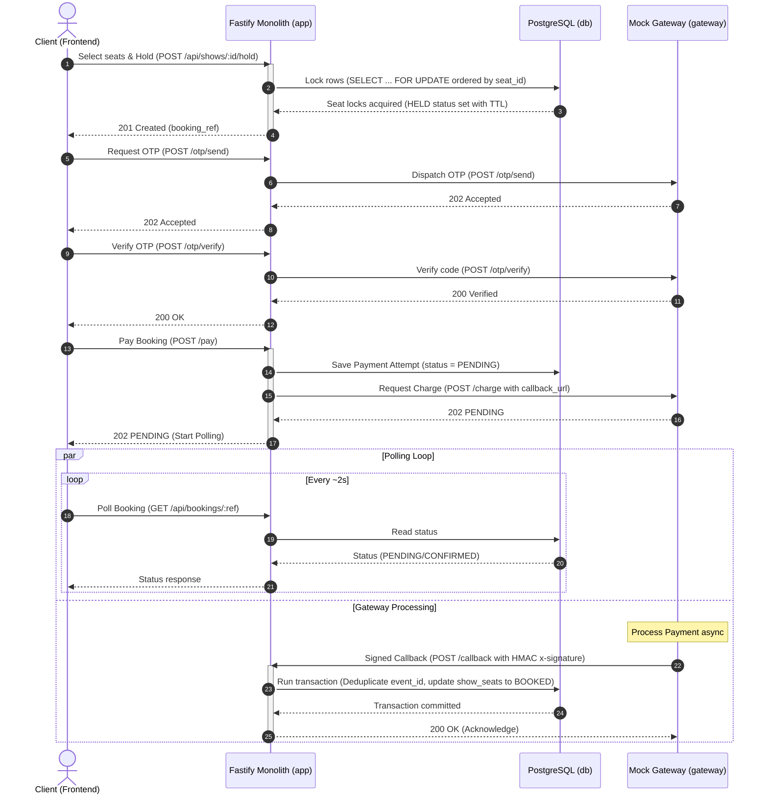

# CinemaSeat — Architecture

**Hackathon submission:** The architecture document submitted during the hackathon is preserved in [`ARCHITECTURE_SUBMITTED.md`](ARCHITECTURE_SUBMITTED.md).

## Overview

CinemaSeat is a movie ticket booking monolith built with Node.js 22/Fastify and PostgreSQL 16. The application runs inside a Docker Compose stack alongside the provided payment and OTP mock gateway image (`asifmahmoud414/mock-gateway:latest`). It guarantees that no seat is ever double-booked or oversold under high concurrency, and that abandoned holds are automatically released.

All core business constraints—atomic seat selection, hold durations, payment attempt tracking, and webhook callback processing—are designed around single-transaction boundaries in PostgreSQL. The backend is stateless, allowing multiple replicas to run behind a load balancer while correctness is maintained through row-level locks and unique constraints at the database tier.

## System Architecture

The following diagram illustrates the relationship between the client, proxy layer, application backend, database, and mock gateway:

```text
                     ┌────────────────────────────────┐
                     │       Browser / Client         │
                     └───────────────┬────────────────┘
                                     │
                                     │ HTTP Requests
                                     ▼
                     ┌────────────────────────────────┐
                     │      web - nginx (:8080)       │
                     │  - React SPA bundle + fallback │
                     │  - /api/* proxied same-origin  │
                     └───────────────┬────────────────┘
                                     │
                                     │ Proxied Request (:3000)
                                     ▼
┌─────────────────────────────────────────────────────────────────────────────┐
│                     app - Node 22 / Fastify Monolith                        │
│  - catalog | booking | payment                                              │
│  - platform (db, config, migrate, health, sweeper)                          │
└────────────────┬───────────────────────────────────────┬────────────────────┘
                 │                                       │
                 │ SQL Transactions                      │ Outbound HTTP
                 │ (Row Locks on show_seats)             │ (/charge, /otp/*)
                 ▼                                       ▼
┌────────────────────────────────┐       ┌────────────────────────────────┐
│         PostgreSQL 16          │       │   gateway (provided, :9000)    │
│  - One row per (show, seat)    │       │  - OTP and payment operations  │
│    = the lock                  │       │  - Sends signed webhooks       │
└────────────────────────────────┘       └───────────────┬────────────────┘
                                                         │
                                                         │ Signed Callbacks
                                                         ▼
                                         ┌────────────────────────────────┐
                                         │    POST /payments/callback     │
                                         │ (Processed by payment module)  │
                                         └────────────────────────────────┘
```

The communication flows are structured as follows:
* **Client to Web**: The browser makes HTTP requests to Nginx on port `8080`, which serves the static React application.
* **API Proxying**: Nginx proxies all `/api/*` endpoints to the monolithic backend service (port `3000`) over the Docker Compose internal network.
* **Database Queries**: The backend application executes SQL transactions on PostgreSQL.
* **Outbound Gateway Requests**: The backend communicates directly with the mock payment gateway on port `9000` to dispatch OTPs and process charges.
* **Asynchronous Webhooks**: The gateway sends signed HTTP POST callback webhooks to `/api/payments/callback` to notify the application of transaction outcomes.

## Components

The system is composed of four containerized services:
1. **web (Nginx)**: Serves the production React frontend SPA (built with React 18, TypeScript, and Vite) with SPA fallback and reverse-proxies `/api/*` requests to backend port `3000`. The frontend bundle contains no hardcoded backend hostnames, using only same-origin relative paths.
2. **app (Fastify Monolith)**: The Node.js application hosting the catalog, booking, and payment business logic, along with platform routines like migrations and the background sweeper.
3. **db (PostgreSQL 16)**: Holds the authoritative seat allocation, booking, and transaction state.
4. **gateway (Mock Payment Gateway)**: The provided mock payment and OTP gateway container service running the `asifmahmoud414/mock-gateway:latest` image.

Inside the Fastify monolith, code is structured into the following logical modules:
* `catalog`: Exposes endpoints to browse movies, theatres, showtimes, and retrieve live seat status maps.
* `booking`: Implements the transactional logic for holding seats, creating bookings, and releasing expired reservations.
* `payment`: Interacts with the gateway for charging accounts, sending and verifying OTP codes, and handling webhook callbacks.
* `platform`: Houses database connection pooling, schema migration runners, configuration parsing, and system health checks.

### Relational Data Model

The PostgreSQL schema is structured as follows:

| Table Name | Description | Key Fields & Constraints |
| :--- | :--- | :--- |
| `movies` | Cinematic catalog details. | `id` (PK), `title`, `duration_min`, `rating`, `description` |
| `theatres` | Cinema location directory. | `id` (PK), `name`, `city` |
| `screens` | Auditorium rooms belonging to theatres. | `id` (PK), `theatre_id` (FK), `name`, `row_count`, `cols_per_row`, `UNIQUE (theatre_id, name)` |
| `seats` | Specific physical seats inside screens. | `id` (PK), `screen_id` (FK), `row_label`, `seat_number`, `UNIQUE (screen_id, row_label, seat_number)` |
| `shows` | Screen-allocated movie showtimes. | `id` (PK), `movie_id` (FK), `screen_id` (FK), `starts_at`, `price_cents`, `UNIQUE (screen_id, starts_at)` |
| `show_seats` | Dynamic seat mapping and locks per show. | `(show_id, seat_id)` (PK), `status` (`AVAILABLE`, `HELD`, `BOOKED`), `booking_id` (FK), `hold_expires_at` |
| `bookings` | Customer ticket reservation records. | `id` (PK UUID), `ref` (UNIQUE), `show_id` (FK), `customer_name`, `customer_phone`, `status` (`HELD`, `PAYMENT_PENDING`, `CONFIRMED`, `FAILED`, `EXPIRED`, `CANCELLED`), `amount_cents`, `otp_verified_at`, `hold_expires_at`, `active_payment_id` (FK), `created_at` |
| `payments` | Individual transaction attempts per booking. | `id` (PK UUID), `booking_id` (FK), `attempt_ref` (UNIQUE), `gateway_payment_id` (UNIQUE), `status` (`PENDING`, `SUCCEEDED`, `FAILED`, `REFUNDED`, `SUPERSEDED`), `needs_refund` (BOOLEAN), `amount_cents`, `created_at` |
| `payment_events` | Webhook callback event idempotency log. | `event_id` (PK), `payment_id`, `booking_ref`, `status`, `payload` (JSONB), `received_at` |

## Booking and Payment Flow

The application coordinates the lifecycle of ticket creation and payment confirmation through a multi-step workflow.

### Workflow Sequence

```text
[Seat Hold] ──► [OTP Verification] ──► [Persist Payment] ──► [Gateway /charge]
                                                                     │
[State Update] ◄── [Callback Validation] ◄── [Async Callback] ◄── [202 PENDING]
```

1. **Seat Hold**: The customer selects seats on the frontend. The backend locks the requested seats in the database, establishes a booking, and marks the seats as `HELD`.
2. **OTP Dispatch & Verification**: The backend triggers OTP dispatch through the gateway (`/otp/send`) and verifies the customer's input (`/otp/verify`). A verified OTP is stamped on the booking as `otp_verified_at` to gate payment.
3. **Persist Payment Attempt**: Before invoking the gateway, the backend inserts a pending record into `payments` and sets the booking’s `active_payment_id`. Writing this record first guarantees the application can resolve webhook callbacks even if they arrive before the outbound `/charge` response returns.
4. **Gateway Charge**: The backend issues a POST request to `/charge` on the gateway, passing a unique `attempt_ref` as the `booking_ref`. An `Idempotency-Key` is sent on every charge request (using the `attempt_ref`), ensuring that gateway retries can never result in a double charge.
5. **Immediate Pending Response**: The gateway returns an immediate `202 PENDING` response. The backend forwards this status, prompting the frontend to poll `/api/bookings/:ref`.
6. **Async Webhook Callback**: The gateway processes the transaction asynchronously and posts the final status to `/api/payments/callback`.
7. **Webhook Validation & State Update**: The callback handler verifies the HMAC-SHA256 signature, deduplicates by `event_id`, and transitions both the payment attempt and the booking state inside a single database transaction.

### Detailed Sequence Diagram



### State Machines

The booking, payment-attempt, and seat statuses transition through the following lifecycles:

```text
Booking:  HELD ──pay──▶ PAYMENT_PENDING ──active cb SUCCEEDED──▶ CONFIRMED
            │                 ├──active cb FAILED──▶ FAILED   (seats released)
            │                 └──safety timeout────▶ FAILED   (seats released,
            │                                        attempt SUPERSEDED)
            └──TTL──▶ EXPIRED (seats released)

Payment attempt:  PENDING ──▶ SUCCEEDED ──▶ REFUNDED
                     │   └──▶ FAILED
                     └──▶ SUPERSEDED ──(late success + refund)──▶ REFUNDED

Seat:  AVAILABLE ⇄ HELD ──▶ BOOKED
```

### Active-Attempt Invariant

To resolve retry races and duplicate callbacks:
* **Active Attempt FK**: Only the payment attempt matching the booking's `active_payment_id` is authorized to confirm a booking.
* **Superseded Attempts**: If a payment attempt fails or times out, a retry creates a new `payments` record with a distinct `attempt_ref` (e.g. `bk_ref-a2`) and updates `bookings.active_payment_id`. The previous attempt is transitioned to `SUPERSEDED`.
* **Refund Flagging**: If a late callback arrives reporting `SUCCEEDED` for a `SUPERSEDED` attempt, the booking is **not** confirmed. The payment record is updated to `needs_refund = true` and logged/flagged for manual reconciliation. No automated refund driver exists to call `/refund` automatically, though if a `REFUNDED` callback is eventually received, the attempt state will transition to `REFUNDED`.

## Concurrency and Data Integrity

The primary safety requirement is that **no seat may be confirmed for more than one user**. This invariant is enforced purely through PostgreSQL row-level locks.

### Seat Reservation Transaction

When a user requests a hold, the backend locks the relevant rows in the `show_seats` table. The transaction logic is represented below:

```sql
BEGIN;
  -- Insert the parent booking record with status 'HELD' and expiration timestamp
  INSERT INTO bookings (ref, show_id, customer_name, customer_phone, status, amount_cents, hold_expires_at)
  VALUES ($1, $2, $3, $4, 'HELD', $5, now() + $6 * interval '1 second')
  RETURNING id;

  -- Lock the target seats in ascending order to prevent deadlocks
  SELECT seat_id 
    FROM show_seats
   WHERE show_id = $2 AND seat_id = ANY($7::bigint[])
   ORDER BY seat_id
     FOR UPDATE;

  -- Verify availability under the lock. If any seat is taken or actively held, ROLLBACK
  -- An expired held seat is eligible for lazy reclamation

  -- Claim the seats atomically by updating their status and booking reference
  UPDATE show_seats
     SET status = 'HELD', booking_id = $booking_id,
         hold_expires_at = now() + $6 * interval '1 second'
   WHERE show_id = $2 AND seat_id = ANY($7::bigint[])
     AND (status = 'AVAILABLE' 
          OR (status = 'HELD' AND hold_expires_at <= now()));

  -- Commit the transaction if the update count matches requested seats, otherwise ROLLBACK
COMMIT;
```

### Locking Rules

* **Deterministic Ordering**: Multi-seat operations always request and lock rows sorted in ascending order of `seat_id`. This prevents deadlock conditions between concurrent transactions.
* **Skip Locked**: The background cleanup sweeper acquires rows with `FOR UPDATE SKIP LOCKED`. Contended seats are ignored and cleaned up on subsequent runs, avoiding lock contention with client-facing threads.
* **Database Time**: Expiration math evaluates against the database clock (`now()`), making the platform immune to server-tier clock drift.
* **Timezone Standardization**: Show scheduling is anchored to Bangladesh Standard Time (BST, UTC+6). The generator shifts dates and times to UTC+6 before processing templates, protecting scheduling logic from shifts caused by host-system or Docker-container timezone variances (e.g. UTC default).

### Expiration Layers

Seat holds expire automatically through two complementary mechanisms:
1. **Lazy Reclaiming**: The seat map queries and hold claims evaluate `status = 'HELD' AND hold_expires_at <= now()` as equivalent to `AVAILABLE`. Expired seats are reclaimed transactionally on read or write without requiring active cron jobs.
2. **Background Sweeper Daemon**: A platform loop runs every `SWEEP_INTERVAL_SECONDS` to actively update expired `HELD` seats back to `AVAILABLE` and update their associated bookings to `EXPIRED`.

When a payment is initiated, the hold is extended to `now() + PAYMENT_PENDING_TIMEOUT_SECONDS`, protecting the seats from reclamation during processing.

### Signature Validation and Deduplication

* **Webhook Signature**: Webhooks sent from the gateway are validated on the backend by calculating the HMAC-SHA256 signature of the raw request payload using `GATEWAY_SECRET`.
* **Idempotency Engine**: Callback processing operates in single transactions. Webhook payloads are inserted into `payment_events`, where a primary key constraint on `event_id` prevents duplicate processing.

## Deployment

The application is deployed as a Docker Compose stack containing four services.

### Ports and Connections

* **Nginx (`web`)**: Listens on public host port `8080` (mapping to port `80` in the container). It acts as the ingress controller.
* **Fastify Monolith (`app`)**: Runs on port `3000` inside the container network.
* **PostgreSQL (`db`)**: Maps to host port `5433` (preventing conflicts with local engines) and listens on port `5432` internally.
* **Gateway (`gateway`)**: Binds to host port `9000`.

A named Docker volume `dbdata` is mounted at `/var/lib/postgresql/data` within the `db` service to ensure restart persistence.

### Key Environment Variables

* `HOLD_TTL_SECONDS`: The duration (seconds) that seats remain held before lazy or active reclamation (never hardcoded).
* `PAYMENT_PENDING_TIMEOUT_SECONDS`: The safety window (seconds) that protects seat holds while payment is pending (default 600 s).
* `SWEEP_INTERVAL_SECONDS`: The frequency at which the background sweeper daemon cleans up expired holds.
* `PORT` / `APP_PORT`: The backend Fastify monolith internal/host listening port (default 3000).
* `WEB_PORT`: The public frontend web server (nginx) port (default 8080).
* `DATABASE_URL`: Connection string for PostgreSQL (`postgres://cinemaseat:cinemaseat@db:5432/cinemaseat`).
* `PGPOOL_MAX`: Maximum size of the database connection pool.
* `GATEWAY_URL`: Address of the mock payment gateway (`http://gateway:9000`).
* `GATEWAY_TIMEOUT_MS`: The network timeout duration for gateway HTTP requests.
* `PUBLIC_CALLBACK_URL`: Target webhook callback address registered with the gateway. This must resolve from the gateway container (`http://app:3000/api/payments/callback`).
* `GATEWAY_SECRET`: The shared webhook authentication key (`z2p-2026-secret`).
* `GATEWAY_SIGNATURE_MODE`: Mode for verifying webhook signatures (`off`, `log`, or `enforce`).
* `OTP_REQUIRED`: Boolean flag stating whether phone OTP verification is required to checkout.
